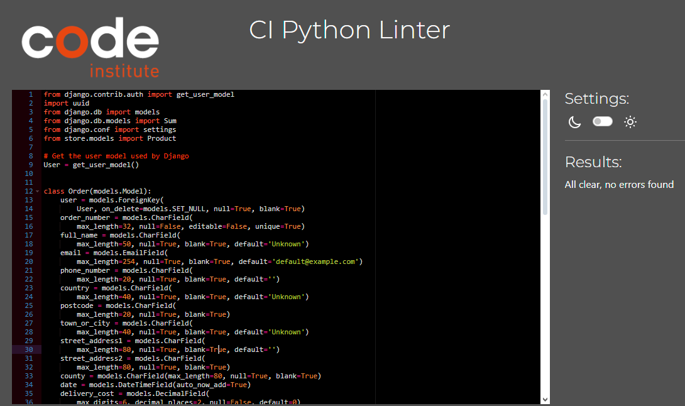
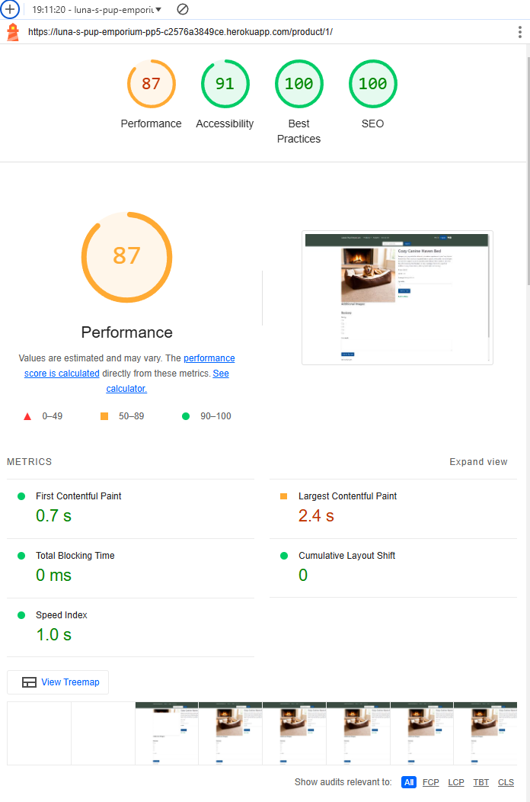
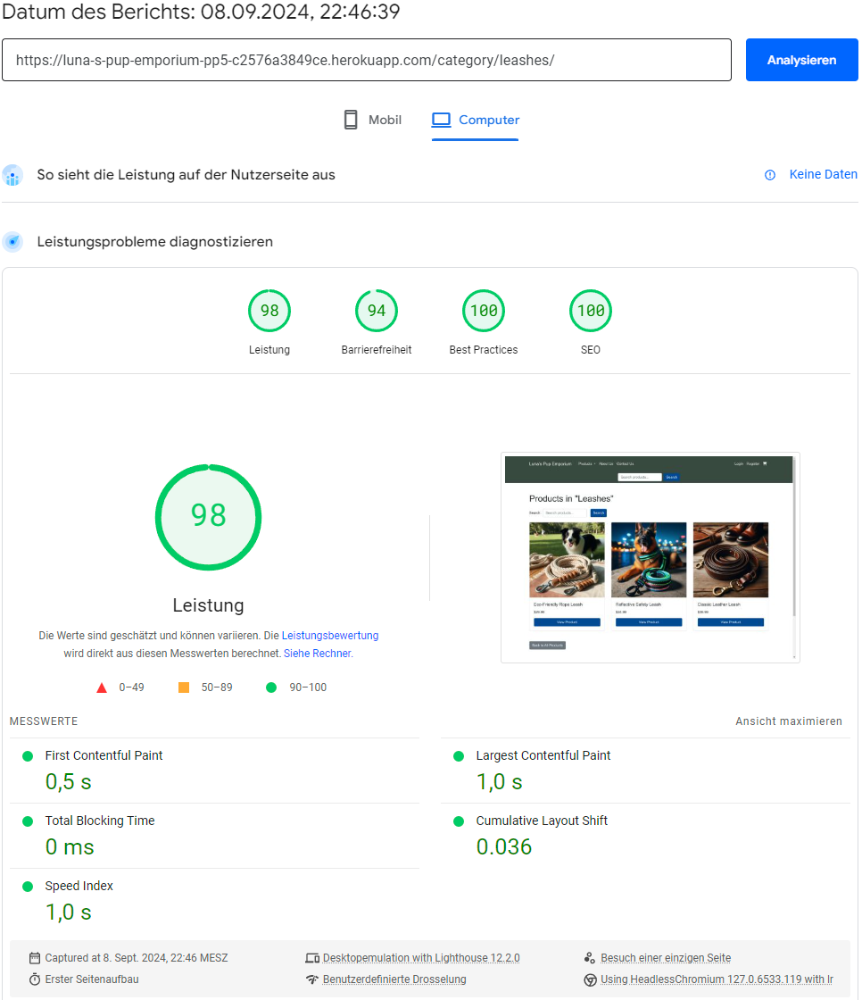

# Luna's Pup Emporium

## Introduction

Welcome to **Luna's Pup Emporium**, your one-stop shop for high-quality dog gadgets and accessories! Our Django-powered e-commerce site offers a curated selection of products to ensure your furry friend's comfort and style. From durable leashes to cozy beds, we have everything you need to pamper your pup.

This project was created as part of Code Institute's Full Stack Software Development Diploma, demonstrating a comprehensive integration of Python, the Stripe API, Google Gmail API, and web development techniques.

### View the live website [here](https://luna-s-pup-emporium-pp5-c2576a3849ce.herokuapp.com)

## User Benefits

### Exceptional Product Range
- **Diverse Categories**: Browse through our categories including Harnesses, Collars, Leashes, Beds, and Toys.
- **Product Details**: View detailed product information including title, description, price, stock, and user reviews.

### Seamless Shopping Experience
- **Search and Sort**: Easily find what you're looking for using our search bar and sorting options by name, price, and rating.
- **User Accounts**: Register, log in, and manage your profile, including order history and details.

### Engaging Features
- **Custom Reviews and Ratings**: Rate products and leave reviews to help others make informed decisions.
- **Cart Management**: Add items to your cart, adjust quantities, and proceed to checkout with ease.

### Comprehensive Support
- **Contact Us**: Send questions or concerns directly to our support team via our Contact Us page.
- **FAQ**: Find answers to common questions quickly in our FAQ section.
- **Terms and Conditions & Privacy Policies**: Review our legal and privacy information to ensure a transparent shopping experience.

### Stay Updated
- **Newsletter**: Subscribe to our newsletter to receive updates, reviews, and special offers.

## Persona: Sarah Thompson - The Passionate Dog Enthusiast
**Basic Information:**

-   **Name:** Sarah Thompson
-   **Age:** 34
-   **Occupation:** Marketing Manager
-   **Location:** Austin, Texas
-   **Family Status:** Married with two dogs, Max (Golden Retriever) and Bella (Cocker Spaniel)

**Background:** Sarah is a marketing manager at a tech company and works primarily from home. She is passionate about dogs and dedicates her free time to exploring new ways to enrich the lives of her furry friends. She frequently participates in local dog events and is a member of several online communities where dog lovers share tips and advice. Her dogs, Max and Bella, are an integral part of her life, and she loves pampering them with the best products available.

**Demographics:**

-   **Income:** $75,000 annually
-   **Education:** Bachelor’s degree in Business Administration
-   **Lifestyle:** Health-conscious, environmentally aware, and tech-savvy
-   **Shopping Preferences:** Prefers online shopping for convenience and variety; values high-quality products and enjoys trying new brands

**Goals and Needs:**

-   **Goals:**
    -   To find innovative and high-quality products that enhance her dogs' well-being and happiness.
    -   To discover reliable brands that align with her values, such as sustainability and animal welfare.
    -   To make the shopping process as efficient and enjoyable as possible, with user-friendly navigation and detailed product information.
-   **Needs:**
    -   A wide selection of products, including leashes, collars, harnesses, toys, and beds, all in one place.
    -   Trustworthy reviews and detailed product descriptions to make informed purchase decisions.
    -   Easy-to-use filtering options to quickly find products suited to her dogs' specific needs and preferences.

**Pain Points:**

-   Difficulty finding well-designed and durable products for active dogs like Max and Bella.
-   Frustration with online shops that have clunky navigation or insufficient product information.
-   Concerns about the environmental impact of dog products and packaging.

**Interests and Hobbies:**

-   Enjoys hiking and outdoor activities with her dogs.
-   Active member of dog training and agility groups.
-   Passionate about photography, often capturing moments of her dogs in nature.
-   Participates in community volunteer events focused on animal welfare.

**Technology and Online Behavior:**

-   Frequently uses social media platforms like Instagram and Pinterest to discover new dog products and trends.
-   Relies on customer reviews and ratings when making online purchases.
-   Uses her smartphone and tablet for browsing and shopping due to the convenience of mobile access.

**Reasons for Visiting the Website:**

-   **Product Variety:** Sarah appreciates the website’s wide range of dog products, allowing her to explore different options and find everything she needs in one place.
-   **User-Friendly Experience:** The easy navigation and well-organized filters make it simple for her to find specific items tailored to her dogs' requirements.
-   **Community Engagement:** She is drawn to the engaging content and product reviews from fellow dog lovers, which help her make confident purchase decisions.

**Marketing Messages:**

-   "Discover the best for your furry family members with our curated selection of high-quality dog products."
-   "Join our community of passionate dog lovers and explore products that prioritize sustainability and innovation."
-   "Enjoy a seamless shopping experience with detailed product insights and customer reviews, all designed to make your decision-making process stress-free."

This persona captures the typical customer who would be attracted to the e-commerce shop, highlighting their motivations, needs, and behaviors that align with the website’s offerings.

## Technologies Used

### Backend
- **Django**: The primary web framework used for building the backend of the application.
- **Django Allauth**: Provides user authentication and account management functionalities.
- **Cloudinary**: Integration for managing and delivering media assets, such as product images. Cloudinary offers image storage, transformation, and delivery services, ensuring efficient media handling.
- **dj-database-url**: Facilitates database configuration from environment variables, useful for deploying the application to cloud platforms.
- **django-cloudinary-storage**: Integrates Cloudinary with Django's storage system to handle media files.

### Frontend
- **Bootstrap**: Used for responsive and mobile-first design.
- **Custom CSS and JavaScript**: For additional styling and interactive features.
- **crispy-bootstrap5**: Provides Bootstrap 5 integration with Django forms for enhanced form styling.

### Database
- **SQLite**: Lightweight and easy-to-set-up database used for development.
- **psycopg2**: PostgreSQL adapter for Python, used for connecting to PostgreSQL databases in production.

### Other Libraries
- **Whitenoise**: Used for serving static files efficiently.
- **gunicorn**: WSGI HTTP server for running Django applications in production.
- **stripe**: Integration for handling payment processing.
- **Pillow**: Imaging library for image processing tasks.
- **cryptography**: Provides cryptographic recipes and primitives for secure data handling.
- **PyJWT**: Library for working with JSON Web Tokens, often used for authentication.
- **python-decouple**: Helps manage configuration and environment variables.
- **sqlparse**: A non-GUI SQL parser for handling SQL queries.

## Features

### Product Categories
- **Harnesses**: Adventure Dog Harness, Comfort Fit Harness, Training Harness with Reflective Trim.
- **Collars**: Classic Leather Leash, Colorful Nylon Collar, Custom Engraved Metal Collar, Luxury Leather Collar.
- **Leashes**: Eco-Friendly Rope Leash, Reflective Safety Leash.
- **Beds**: Cozy Canine Haven Bed, Modern Minimalist Bed, Outdoor Adventure Bed.
- **Toys**: Durable Chew Toy, Plush Squeaky Toy, Soft Play Frisbee.

### Shopping Experience
- **Product Sorting**: Sort products by name, price, and rating in both ascending and descending order.
- **Search Functionality**: Find specific products easily using the search bar.

### User Accounts
- **Profile Management**: Users can view, update, and delete their profile information, as well as view their order history.
-  **Order Details**: View detailed information about individual orders.

### Cart and Checkout
- **Cart Details**: View and edit items in the cart, adjust quantities, and proceed to checkout.
- **Checkout**: Provide shipping and payment information for completing purchases.
- **Order Confirmation**: Receive an overview of your order including the order number and total price upon successful payment.

### Content Pages
- **About Us**: Learn about the shop’s mission, the owner, and their passion for dog gadgets.
- **Contact Us**: Send questions, concerns, and issues directly to the shop’s official email.
- **FAQ**: Access answers to frequently asked questions.
- **Terms and Conditions**: Review the terms and conditions governing the use of the site.
- **Privacy Policies**: Understand how user data is collected, used, and protected.

### Newsletter
- **Subscription**: Subscribe to the newsletter to receive updates, benefits, and exclusive content.

## Business Model

This business model outlines the core structure for running a digital production company's channel. It focuses on creating engaging, informative content and building a robust customer base, particularly through social platforms. Here's an overview of the key aspects:

### 1. **Key Partners**

-   **Marketing Agencies**: Assist with digital marketing and customer outreach.
-   **Tech Partners**: Provide platform development and maintenance (e.g., Google API, GitHub).
-   **Payment Gateways**: Currently using Stripe for smooth transaction management.
-   **Product Suppliers/Manufacturers**: For physical goods when applicable.
-   **Content Creators & Influencers**: Partnering with influencers for brand promotion.
-   **Shipping/Logistics Providers**: Once physical goods are sold, managing shipping.
-   **Advertising Platforms**: Facebook, Instagram, TikTok for targeted ads and community building.

### 2. **Key Activities**

-   **Content Creation**: Regular production of blogs, videos, and podcasts.
-   **Community Engagement**: Interacting with followers on social media platforms.
-   **Platform Development**: Enhancing platform/app functionality.
-   **Data Analytics**: Tracking user behavior to optimize engagement and conversions.
-   **Marketing and Advertising**: Social media campaigns, email marketing, and influencer partnerships.

### 3. **Value Proposition**

-   **Engaging Content**: Solving audience problems through content tailored to their needs.
-   **Exclusive Access**: Early content releases, special offers, and behind-the-scenes experiences.
-   **Personalized Products/Services**: Offering personalized solutions to customers.
-   **Innovation**: Constantly exploring new ways to offer unique and premium digital experiences.

### 4. **Customer Relationships**

-   **Social Media Engagement**: Regular updates via platforms like Instagram, Facebook, etc.
-   **Email Campaigns**: Personalized marketing and newsletters.
-   **Feedback Loop**: Collecting and acting on customer feedback.
-   **Loyalty Programs**: Offering exclusive discounts to repeat customers.

### 5. **Customer Segments**

-   **Millennials & Gen Z (Active Social Media Users)**: Individuals who actively engage in digital content.
-   **Professionals/Enterprises**: Businesses looking to enhance their digital offerings.
-   **Casual Users**: Occasional viewers who can be converted into loyal customers.
-   **Pet Product Enthusiasts**: Individuals who own premium pet gadgets or are interested in them.

### 6. **Channels**

-   **Social Media Platforms**: Instagram, Facebook, TikTok, and YouTube for audience outreach.
-   **SEO**: Driving traffic through content marketing.
-   **Email Marketing**: Newsletters and promotional updates.
-   **Website**: The central hub for content, resources, and product offerings.

### 7. **Key Resources**

-   **Technology Infrastructure**: Servers, cloud storage, and apps (e.g., SQL, Cloudinary).
-   **Skilled Team**: Developers, content creators, marketers.
-   **Customer Data**: User insights and behavior for personalized marketing.
-   **Digital Tools**: Analytics, social media schedulers, and more.

### 8. **Cost Structure**

-   **Platform Development**: Building and maintaining the digital platform (website, app, etc.).
-   **Marketing & Advertising**: Paid ads, social media, and influencer partnerships.
-   **Content Creation**: Budget for creators and editors.
-   **Technology & Infrastructure**: Hosting, storage, and other tech services.
-   **Customer Acquisition**: Costs related to gaining new users through multiple channels.

### 9. **Revenue Streams**

-   **Subscription Fees**: Monthly/annual memberships for premium content or services.
-   **Affiliate Sales**: Promoting and selling third-party products.
-   **Advertisements**: Running ads or collaborating with brands for sponsorship.
-   **Crowdfunding/Donations**: Generating income through platforms like Patreon or Kickstarter.

### Program Flowchart

 |

1.  **Home Page**
    
    -   User lands on the homepage.
    -   Options: Browse all products, search for products, or navigate through the categories (Harnesses, Collars, Leashes, Beds, Toys).
2.  **Product Search or Category Navigation**
    
    -   **Search Bar**: User searches for a product by name or keyword.
    -   **Category Page**: User selects a category (e.g., Harnesses, Collars, etc.) and views product listings.
    -   Products can be filtered by **price**, **rating**, or **review count**.
3.  **Product List Page**
    
    -   User sees a list of products based on the search or category.
    -   **Actions**: Sort products (by name, price, rating) and apply filters (price, rating).
    -   User clicks on a product to view details.
4.  **Product Detail Page**
    
    -   Displays the product’s details: name, description, price, stock, and user reviews.
    -   **Actions**:
        -   Add the product to the cart.
        -   View related products.
        -   Write a review.
5.  **Cart Page**
    
    -   User views items added to the cart, along with the total price.
    -   **Actions**:
        -   Update the quantity of items.
        -   Remove items from the cart.
        -   Proceed to checkout.
6.  **Checkout Page**
    
    -   User enters shipping information and payment details via **Stripe**.
    -   **Actions**:
        -   Review order summary (products, price, shipping, total).
        -   Submit the payment.
7.  **Order Confirmation**
    
    -   After a successful payment, user is redirected to the **Order Confirmation** page.
    -   **Details**: Displays the order number, product details, and total cost.
    -   **Email**: A confirmation email is sent to the user using the **Google Gmail API**.
8.  **User Profile**
    
    -   User views or edits their profile information.
    -   **Actions**:
        -   View past orders and access detailed order history.
        -   Update personal details or delete the profile.
9.  **Content Pages**
    
    -   User navigates to static content pages like **About Us**, **Contact Us**, **FAQ**, **Terms and Conditions**, and **Privacy Policies**.
    -   **Contact Us**: Submits an inquiry or message, and receives an email confirmation.
10.  **Newsletter Signup**

-   User subscribes to the newsletter by providing an email address.
    -   **Confirmation**: A success message is displayed, and a confirmation email is sent via the Gmail API.
----------

### **Key Features Integration**

-   **User Authentication**: Log in, register, and manage profiles using Django Allauth.
-   **Payment**: Stripe API integration for secure payment processing.
-   **Email Communication**: Google Gmail API to send order confirmations and contact form responses.

This flowchart represents the user journey, starting from browsing products, making purchases, managing their profile, and utilizing additional content and support functionalities.

## Testing

### Code Validation

#### HTML

I have used the recommended [HTML W3C Validator](https://validator.w3.org) to validate all of my HTML files.

| Directory | File | Screenshot |
| --- | --- | --- |
| store | index.html |  |  
| store | about_us.html |  |
| profile | profile.html |  |  
| store | contact_us.html |  |  
| account | login.html |  |
| account | signup.html |  |    
| store | newsletter.html |  |  
| store | faq.html |  |  
| cart | cart_detail.html |  | 
| checkout | payment.html |  | 
| checkout | checkout.html |  | 
| checkout | order_confirmation.html |  | 
| store | order_detail.html |  |  
| store | privacy_policies.html |  |  
| store | product_detail.html |  |  
| store | product_list.html |  | 
| store | all_products.html |  | 
| store | special_offers.html |  | 
| store | terms_conditions.html |  | 

#### CSS

I have used the recommended [CSS Jigsaw Validator](https://jigsaw.w3.org/css-validator) to validate all of my CSS files.

| Directory | File | Screenshot |
| --- | --- | --- | 
| static | main.css |  |

#### JavaScript

I have used the recommended [JShint Validator](https://jshint.com) to validate all of my JS files.

| Directory | File | Screenshot 
| --- | --- | --- |
| static | main.js |  |  

#### Python

I have used the recommended [PEP8 CI Python Linter](https://pep8ci.herokuapp.com) to validate all of my Python files.

| File                                   | Screenshot                                                                 |
| -------------------------------------- | -------------------------------------------------------------------------- |
| `lunaspupemporium/urls.py`             |  |
| `cart/apps.py`                         |   |
| `cart/admin.py`                        |  |
| `cart/forms.py`                        |  |
| `cart/templatetags/form_extras.py`     |  |
| `cart/models.py`                       |  |
| `cart/urls.py`                         |   |
| `cart/views.py`                        |  |
| `checkout/apps.py`                     |  |
| `checkout/admin.py`                    |  |
| `checkout/forms.py`                    |  |
| `checkout/signals.py`                  |  |
| `checkout/models.py`                   |  |
| `checkout/urls.py`                     |  |
| `checkout/views.py`                    |  |
| `profiles/apps.py`                     |  |
| `profiles/admin.py`                    |  |
| `profiles/forms.py`                    |  |
| `profiles/templatetags/custom_filters.py` |  |
| `profiles/signals.py`                  |  |
| `profiles/models.py`                   |  |
| `profiles/urls.py`                     |   |
| `profiles/views.py`                    |  |
| `store/apps.py`                        |     |
| `store/admin.py`                       |    |
| `store/forms.py`                       |    |
| `store/templatetags/store_filters.py`  |  |
| `store/email_utils.py`                 |  |
| `store/models.py`                      |   |
| `store/urls.py`                        |     |
| `store/views.py`                       |    |

#### Lighthouse Audit
----------------

I've tested my deployed project using the Lighthouse Audit tool to check for any major issues.
I acknowledge the issues i have in the current version, but i was not able to find any fixes in the time i have been given to perfect the scores.
I also checked every contrast issue that came up and would argue against the issue, as everything is easily readable.

##### Desktop
| Page | Screenshot |
| --- | --- |
| Index |  |  
| About Us |  |
| Profile |  |   
| Contact Us |  |   
| Login |  | 
| Signup |  | 
| Newsletter |  |  
| FAQ |  |    
| Cart Detail |  | 
| Checkout |  |   
| Order Confirmation |  |
| Order Detail |  |   
| Privacy Policies |  | 
| Product Detail |  |  
| Product List |  |  
| All Products |  | 
| Special Offers |  |  
| Terms & Conditions |  |  

##### Mobile
| Page | Screenshot |
| --- | --- |
| Index |  |  
| About Us |  |
| Profile |  |   
| Contact Us |  |   
| Login |  | 
| Signup |  | 
| Newsletter |  |  
| FAQ |  |    
| Cart Detail |  |  
| Checkout |  |   
| Order Confirmation |  |
| Order Detail |  |   
| Privacy Policies |  | 
| Product Detail |  |  
| Product List |  |  
| All Products |  | 
| Special Offers |  |  
| Terms & Conditions |  |  

### General Testing
-   Each feature was developed on the main branch. 
-   Each time a feature was added, all the functions were tested to see if there was an impact.
-   The site was sent to friends and relatives for feedback and testing.
-   The username input has a validation and will not submit without the proper information.
-   .gitignore file has been included to prevent system file commits.
-   External links open in a new tab.

## Manual Testing

The below table provides evidence of manual testing carried out for each feature.

| Feature                | Test                                                              | Expected Outcome                                               | Screenshot                                                        | Pass/Fail |
| ---------------------- | ----------------------------------------------------------------- | -------------------------------------------------------------- | ----------------------------------------------------------------- | --------- |
| Register               | Register a new user                                               | User is registered and redirected to the login page             |       | Pass      |
| Login                  | Log in with registered user                                       | User is logged in and redirected to the profile page            |          | Pass      |
| Add to Cart            | Add a product to the shopping cart                                | Product is added to the cart and displayed in the cart page     |      | Pass      |
| Update Cart            | Update product quantity in the cart                               | Cart is updated with correct quantity and total price           |     | Pass      |
| Remove from Cart       | Remove a product from the shopping cart                           | Product is removed from the cart and cart page is updated       | | Pass      |
| View Cart              | View the shopping cart                                            | All added products are displayed with correct totals            |       | Pass      |
| Checkout               | Complete the checkout process                                     | User is redirected to payment page with correct order summary   |       | Pass      |
| Payment                | Proceed with payment using valid payment details                  | Payment is processed, and user is redirected to order confirmation page |  | Pass      |
| Order Confirmation     | View order confirmation after successful checkout                 | Order details are displayed, and confirmation email is sent     | | Pass |
| View Orders            | View past orders in the user’s profile                            | All previous orders are displayed with details                  |     | Pass      |
| Contact Us             | Submit the contact form with valid details                        | Form is submitted, and a success message is displayed           |      | Pass      |
| Newsletter Signup      | Subscribe to the newsletter using a valid email address           | User is subscribed, and confirmation message is shown           |     | Pass      |
| Product Search         | Search for products using the search bar                          | Matching products are displayed in the product list page        |  | Pass      |
| Product Detail         | View a product’s detail page                                      | Product details, price, and options are displayed               |  | Pass      |
| Filter Products        | Use filters to sort products (eg. price, review) | Filtered products are displayed in the product list             | | Pass      |
| Special Offers         | View special offers page                                          | Discounted products are displayed with promotional information  |  | Pass      |
| Profile                | View user’s profile                                               | Profile page with user details and order history is displayed   |        | Pass      |

### Mobile Testing

-   I tested the site personally on my Android device, going through the entire process, checking buttons, functions, restarting the game, etc. I was personally unable to test on iOS.
-   The site was sent to friends and relatives for them to follow the same process. They have tested on their devices, only missing iOS devices.
- The testing was done using the Google Chrome Browser. Chrome Developer Tools were used extensively, particularly to check responsiveness on different screen sizes. Testing was also done using Firefox and Opera on desktop, and again on Google Chrome and Opera and Brave on the Nothing Phone (2).
-   Responsive on all device sizes between 320px - 2600px wide.
-   Devices tested using the Google Developer Tools emulator:

| Device                   | Device Size    | Tested |
|--------------------------|----------------|--------|
| BlackBerry Z30           | 360px x 640px  | ✅     |
| BlackBerry PlayBook      | 600px x 1024px | ✅     |
| Samsung Galaxy Note 3    | 360px x 640px  | ✅     |
| Samsung Galaxy S3        | 360px x 640px  | ✅     |
| Samsung Galaxy S9+       | 320px x 658px  | ✅     |
| LG Optimus L70           | 384px x 640px  | ✅     |
| Microsoft Lumia 550      | 640px x 360px  | ✅     |
| Microsoft Lumia 950      | 360px x 640px  | ✅     |
| Nexus 4                  | 384px x 640px  | ✅     |
| Nokia Lumia 520          | 320px x 533px  | ✅     |
| Nokia N9                 | 480px x 854px  | ✅     |
| Pixel 3                  | 393px x 786px  | ✅     |
| Apple iPad Mini          | 468px x 4024px | ✅     |
| Apple iPhone 4           | 320px x 480px  | ✅     |
| Apple iPhone 5/S         | 320px x 568px  | ✅     |
| Apple iPhone 6/7/8       | 375px x 667px  | ✅     |
| Apple iPhone 6/7/8 Plus  | 414px x 736px  | ✅     |
| Apple iPhone X           | 375px x 812px  | ✅     |
***

### Development Bugs

-   **Issue**: Cart item quantity buttons overlap with table header on small screen sizes.
    
    -   **Solution**: Applied responsive design fixes to ensure the quantity buttons and input fields are correctly sized and aligned on all screen sizes. Adjusted table layout using CSS media queries to handle mobile views properly.
-   **Issue**: Incorrect subtotal calculation when updating the cart.
    
    -   **Solution**: Fixed the JavaScript logic for handling quantity changes, ensuring that the subtotal is updated dynamically without page reloads. Adjusted the formula in `update_cart()` view to correctly calculate subtotal based on updated quantities.
-   **Issue**: `FormView` used instead of `UpdateView` for editing cart items, leading to unnecessary form validation issues.
    
    -   **Solution**: Switched to `UpdateView` for cart items to leverage built-in form handling and validation for updating product quantities.
-   **Issue**: Error 500 occurring during the checkout process when no items are in the cart.
    
    -   **Solution**: Added a check in the `checkout` view to redirect users back to the cart page with an error message if the cart is empty.
-   **Issue**: Products not showing properly due to incorrect queryset filtering in the product detail view.
    
    -   **Solution**: Ensured the `get_queryset()` method in the product detail view correctly filters products by availability, handling edge cases like out-of-stock or unpublished products.
-   **Issue**: Missing images for products on the cart detail page.
    
    -   **Solution**: Verified that all product image URLs are correct and added fallback logic in the template to display a placeholder image if the product's image is missing.
-   **Issue**: Problems with user registration emails not being sent.
    
    -   **Solution**: Debugged the email configuration, ensuring that Gmail OAuth2 setup is complete. Verified that App Passwords were generated and added correct credentials in Django settings.
-   **Issue**: Users not being redirected to the login page when attempting to access the cart or checkout without being logged in.
    
    -   **Solution**: Implemented `LoginRequiredMixin` for views that handle cart and checkout to ensure users are redirected to the login page if they are not authenticated.
-   **Issue**: Product quantities going negative due to lack of validation on the frontend.
    
    -   **Solution**: Added client-side validation in JavaScript to prevent users from reducing quantities below 1. Also enforced validation in the backend to ensure product quantities are valid before processing the request.
-   **Issue**: Cart not updating correctly after removing an item.
    
    -   **Solution**: Fixed an issue with the AJAX request for removing items from the cart, ensuring the cart is properly refreshed and subtotal recalculated after an item is deleted.
-   **Issue**: Slowness in rendering product listings due to inefficient database queries.
    
    -   **Solution**: Optimized queries by using `select_related` and `prefetch_related` in the product list view to minimize the number of database hits.
-   **Issue**: Inconsistent redirection behavior after cart updates.
    
    -   **Solution**: Standardized the redirection logic using `reverse_lazy` and added custom success messages when cart operations (add, update, remove) are performed successfully.
-   **Issue**: Errors during database migrations when adding new fields to the `Product` model.
    
    -   **Solution**: Ensured all new fields have default values or are nullable, and ran `makemigrations` and `migrate` commands in the correct order. Added fallback logic to handle existing database records with missing fields.
-   **Issue**: Validation errors when submitting user reviews for products.
    
    -   **Solution**: Fixed the review form validation logic, ensuring all required fields (e.g., rating, review text) are properly validated before submission. Implemented error messages to provide user-friendly feedback on invalid form inputs.

### Unresolved Issues / Future Plans

-   **Django AllAuth Pages and Forms Custom Style Rules Did Not Work As Intended**  
    While the functionality of Django AllAuth is fully integrated, the registration, and password reset forms remain unstyled due to difficulties in customizing the form input layouts. The issue lies in adjusting the positioning of individual form fields using the templating structure provided by AllAuth, which conflicts with custom CSS intended for form styling. Future plans include creating custom form templates or extending the existing ones for better UI consistency with the rest of the application.
    
-   **Less Graphic Rating/Review Form Than Planned**  
    The current implementation of the rating and review form lacks some of the planned visual elements. Although the form works as intended, the graphical representation of decimal number ratings is simpler than originally designed. Future improvements may involve adding more user-friendly, graphical elements such as clickable stars or emojis to enhance the review process.
    
-   **Limited Product Images Due to AI Generation**  
    Additional product images could not be added because the use of AI-generated visuals produced inconsistent results. Since the AI-generated images sometimes failed to match the real-world product designs accurately, it was decided to avoid introducing too many fictional products. A future improvement would involve collaborating with professional photographers for real products after finalizing the project with my diploma.
    
-   **Order Confirmation Page Lacks Order Status**  
    The order confirmation page does not currently display the real-time status of an order. Since this is a project and not a live e-commerce shop, no logistics or ERP systems are connected to handle the tracking or fulfillment of orders. If the project were to evolve into a real-world application, integrating order status tracking through third-party logistics (3PL) systems or ERP software would be a future priority.

## Wireframes

Following you will find my initial wireframes i created while planning this project.
I was not able to create every feature i planned, due to the time restriction.
That means, the result you can see right now on the deployed page looks different, than the wireframes i created.

### Desktop

| Page | Screenshot |
| --- | --- |
| Index |  |
| Product List |  |
| Product Detail |  |
| Cart |  |
| Checkout |  |

### Tablet

| Page | Screenshot |
| --- | --- |
| Index |  |
| Product List |  |
| Product Detail |  |
| Cart |  |
| Checkout |  |

### Mobile

| Page | Screenshot |
| --- | --- |
| Index |  |
| Product List |  |
| Product Detail |  |
| Cart |  |
| Checkout |  |

## Data Storage

Luna's Pup Emporium utilizes PostgreSQL for robust data storage and management, with Cloudinary handling media assets. Here’s how data is organized and managed within the app:

### User Information

- The `User` model in the `users` app stores details such as usernames, email addresses, and password hashes. This information is crucial for user authentication and creating personalized experiences within the shop.

### Products and Categories

- The `Product` and `Category` models in the `products` app manage the storage of product details and categories respectively. This includes product names, descriptions, prices, stock levels, and category associations.

### Orders and Cart Information

- Order details and cart information are tracked through models such as `Order`, `OrderItem`, and `Cart`. These models store information about user orders, items in the cart, quantities, and order statuses, enabling efficient management of purchases and inventory.

### Media Storage

- Cloudinary is used for managing and serving media assets, such as product images and additional visuals. This allows for efficient handling and delivery of high-quality images, ensuring a better user experience on the site.

### Newsletter Subscriptions

- The `NewsletterSubscription` model manages user subscriptions to the newsletter. It stores subscriber email addresses and preferences, allowing for targeted communication and updates about new products, promotions, and other shop news.

### Contact Us Inquiries

- User inquiries submitted through the Contact Us page are stored in the `ContactInquiry` model. This includes user names, email addresses, and message content, which are used to respond to questions, concerns, and issues submitted by users.

## Data Handling and Privacy

### Django ORM Integration

- The app integrates with PostgreSQL using Django’s Object-Relational Mapping (ORM) system. This facilitates smooth database operations and helps maintain a clean and manageable codebase.

### Data Privacy

- Sensitive data, such as user passwords, are hashed before storage using Django’s built-in hashing mechanisms. This ensures that even if the database is compromised, user passwords remain secure.

### Real-Time Updates

- The app updates cart information and order statuses in real-time. This ensures users receive immediate feedback on their purchases and cart modifications.

### Security Measures

- Django’s built-in security features, including SQL injection prevention, cross-site scripting (XSS) protection, and cross-site request forgery (CSRF) protection, are employed to enhance the security of data interactions within the app.

### Static and Media Files Management

- Cloudinary handles the storage and serving of media files, such as product images, ensuring high performance and reliability. Static files, including CSS, JavaScript, and other assets necessary for the front-end, are managed securely to provide optimal performance.

### API Integration

The application integrates with several external APIs to enhance functionality and provide a seamless user experience:

#### Stripe API
- **Payment Processing**: The Stripe API is used to handle secure payment processing during the checkout process. It ensures that all transactions are securely handled, providing customers with a variety of payment options. The integration includes features such as:
  - Secure handling of payment information.
  - Real-time transaction status updates.
  - Support for various payment methods, including credit/debit cards.

#### Google Gmail API
- **Email Notifications**: The Google Gmail API is used to send automated email notifications to users. This includes:
  - **Order Confirmation Emails**: Sent to users after a successful purchase, providing them with details of their order.
  - **Newsletter Subscription**: Automated welcome emails and regular newsletters are sent to subscribers using this API.
  - **Contact Form Responses**: When users submit queries through the Contact Us page, responses are handled via the Gmail API.

## Agile Methodology

In this project, I adopted an agile approach to manage the development of **Luna’s Pup Emporium**. While GitHub Pages is often used for agile project management, I found it uncomfortable for managing the project as a solo developer. Instead, I opted to use **Notion**, a powerful and flexible tool that allowed me to organize, plan, and track every phase of the development process.

### Why I Chose Notion

**Notion** proved to be an excellent platform for this project, offering a wide range of features that made it ideal for creating to-do lists, managing milestones, and documenting the entire development process. Some of the key advantages of using Notion included:

-   **Task Management**: I could easily create tasks and assign due dates, keeping track of each feature’s progress.
-   **Customizable Workflow**: Notion allowed me to create custom databases for tracking project milestones, sprints, and any blockers that arose during development.
-   **Centralized Documentation**: Instead of scattering documentation across multiple platforms, I could consolidate everything—wireframes, project notes, and feedback—into one cohesive workspace.

### Agile Plan

The following is the agile plan I followed throughout the project. Each milestone was carefully tracked in Notion, ensuring I met my deadlines with some fixes and adjustments along the way.

----------

### **1. Project Initialization (10th August - 12th August)**

-   **Set Up Development Environment**: Installed and configured Django, PostgreSQL, and Git.
-   **Create Project Repository**: Structured the project files from the beginning.

### **2. Database Design & Setup (13th August - 16th August)**

-   **Design Database Schema**: Created a flexible schema to accommodate future features.
-   **Set Up Database**: Implemented the schema using Django migrations.

### **3. Backend Development (17th August - 24th August)**

-   **Product Management System**: Developed models and CRUD operations for product management.
-   **User Authentication**: Implemented login, registration, and profile management.
-   **Shopping Cart & Order Management**: Added functionality to manage user carts and process orders.

### **4. Frontend Development (25th August - 31st August)**

-   **Homepage Design**: Designed and implemented the homepage with search functionality.
-   **Product Listing & Filters**: Created an intuitive product filtering system.
-   **Product Details Page**: Developed detailed product pages with multiple images and descriptions.
-   **Cart & Checkout Pages**: Designed user-friendly cart and payment pages.

### **5. Integration & Testing (1st September - 5th September)**

-   **Integrate Frontend with Backend**: Ensured smooth data flow between the frontend and backend.
-   **Testing**: Performed unit and integration testing to validate functionality.
-   **User Acceptance Testing**: Ensured a smooth user experience.

### **6. Final Review & Deployment Preparation (6th September - 7th September)**

-   **Code Review**: Optimized and refactored the codebase for production.
-   **Deployment**: Prepared the production environment and deployed the application.

### **7. Documentation & Wrap-Up (8th September - 9th September)**

-   **Documentation**: Documented the development process and created a final project report.
-   **Go-Live Simulation**: Tested the go-live process to ensure everything was ready for launch.

----------

### The Benefits of Notion

Working with Notion provided a smooth project management experience. Its flexibility allowed me to document both large milestones and small tweaks effectively. Although some challenges emerged, such as compatibility issues and unanticipated bugs, Notion helped me keep everything organized and easily accessible, streamlining the entire development process.

In conclusion, adopting an agile approach and using Notion as my project management tool ensured that **Luna's Pup Emporium** met all its project goals, allowing me to focus on delivering high-quality features while keeping the project timeline in check.

## Deployment

Luna's Pup Emporium was developed using Gitpod and Visual Studio Code for code creation and file management. The project files, code, and related information are hosted on GitHub.

### Deploying the App

To deploy Luna's Pup Emporium on Heroku, follow these steps:

1. **Heroku Account Setup:** Log in to Heroku or create an account if you haven't already.
2. **Create a New App:** From the Heroku dashboard, click on the "New" button and select "Create new app" from the dropdown menu.
3. **App Configuration:** Provide a unique name for your application and select the appropriate region.
   - Example: Name: "lunas-pup-emporium", Region: Europe.
4. **Add Config Vars (if necessary):**
   - If your project requires environment variables, add them under the "Settings" tab in the "Config Vars" section.
5. **Set Buildpacks:**
   - Navigate to the "Settings" tab and locate the "Buildpacks" section.
   - Click on "Add buildpack" and select Python.
   - Ensure the Python buildpack is positioned as the primary buildpack.
6. **Deploy from GitHub:**
   - Go to the "Deploy" section and choose "GitHub" as the deployment method.
   - Connect your GitHub repository to Heroku by searching for the repository name and clicking "Connect".
   - Scroll down and click "Deploy Branch" to deploy the app.
7. **Automatic Deploys (Optional):**
   - If desired, enable automatic deploys to rebuild the app whenever changes are pushed to GitHub.

### Forking The Repository

You can fork the Luna's Pup Emporium repository to create a copy for viewing and editing without affecting the original. Follow these steps:

1. Navigate to the repository on GitHub.
2. Click on the "fork" tab in the top right corner.
3. Click on "create fork" to fork the repository.

### Cloning The Repository

To clone the Luna's Pup Emporium repository from GitHub:

1. Go to the repository and select the "code" tab.
2. Copy the repository's HTTPS URL.
3. Open Git Bash and navigate to the desired directory.
4. Type `git clone` followed by the copied URL and press "enter".

## Credits

### Content
- **Code Institute**: For the structure and guidelines for this project.
- **W3Schools**: For detailed tutorials and references on HTML, CSS, and JavaScript. <https://www.w3schools.com>
- **MDN Web Docs**: For comprehensive documentation on web technologies, including JavaScript and CSS. <https://developer.mozilla.org>
- **Stack Overflow**: For community-driven support and solutions to coding problems encountered during development. <https://stackoverflow.com>
- **Chat GPT**: For helping troubleshoot with code and create content for the website and the README.md. <https://chatgpt.com>
- **Django Documentation**: For resources and guides.
- **Bootstrap Documentation**: For resources and guides.

### Media
- **Font Awesome, Google Fonts**: For enhancing the visual appeal.
- **Microsof Bing Copilot**: For creating all images on the website. <https://www.bing.com/images/create?FORM=GDPGLP>

## Acknowledgements: 
- A very special thanks to Pascal the most helpful person i ever met.  He has helped me tremendously with ideas, fixes and feedback.

- I also want to thank my Mentor Rory-Patrick who gave me so many tips and tricks, and inspired me along the way.

- Also very special thanks to my dog who provided emotional support and times to unwind.
